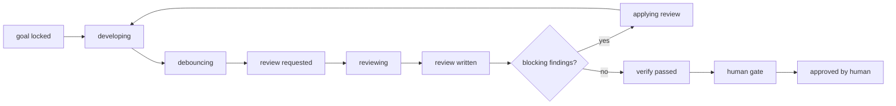
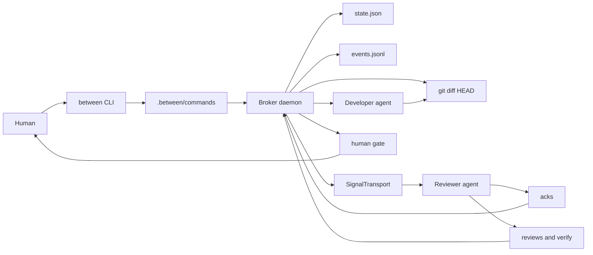

<div align="center">

```text
 ____  _____ _______        _______ _____ _   _
| __ )| ____|_   _\ \      / / ____| ____| \ | |
|  _ \|  _|   | |  \ \ /\ / /|  _| |  _| |  \| |
| |_) | |___  | |   \ V  V / | |___| |___| |\  |
|____/|_____| |_|    \_/\_/  |_____|_____|_| \_|
```

### A local IDE broker for AI pair development.

Between watches the repository, not private agent chats. A developer agent and a
reviewer agent coordinate through `git diff`, durable JSON state, review files,
and short broker signals while the human keeps final authority over merge,
deploy, and rule promotion.

[](https://github.com/ashmoonori-afk/between/actions/workflows/ci.yml)


</div>

---

## What Between Is

Most AI pair-programming setups put two agents in one transcript or make the
human relay messages between them. Between takes a stricter shape:

- The broker watches `git diff`, hashes stable changes, and starts review cycles.
- Agents never talk directly to each other.
- The reviewer reads the real tree and writes structured review output.
- The developer receives only the broker's short "reflect this review" signal.
- State, events, acks, reviews, verification, and approvals are plain local files
  under `.between/`.
- The loop can recover after restarts and will not approve a diff that changed
  under review.
- The human is the only actor allowed to approve `merge`, `deploy`, or
  `promote_rule`.

Think of it as a local, file-shaped protocol for controlled AI collaboration:
IDE-native, restartable, inspectable, and conservative about trust.

## Legacy Terminal Diagnostic Capture

Captured from the built CLI with `node dist/cli.js dash --once` after
`between init --agent fake` in a temporary git repository.

```text
+------------------------------------------------------------------------------------------+
| B BETWEEN session:readme-tui-capture | 15:58:01                                          |
| PHASE IDLE | WAIT - | CYCLE 0 | GOAL 0 | TRUST simulated                                 |
+------------------------------------------------------------------------------------------+
| BROKER stable | DIFF 0 files +0 -0 | HASH - | BUNDLE -                                   |
| REVIEW - | SIGNAL -                                                                      |
+------------------------------------------------------------------------------------------+
| DEVELOPER fake status idle | snap -                                                      |
| REVIEWER fake status idle | review - | trust simulated                                   |
+------------------------------------------------------------------------------------------+
| RECENT EVENTS                                                                            |
| no events yet                                                                            |
| COMMANDS r review now (off) | esc abort agents (off) | p pause | s stop broker | q qu... |
+------------------------------------------------------------------------------------------+
```

This terminal frame remains as a diagnostic and fallback surface. The product
surface is the IDE cockpit below.

## VS Code IDE Cockpit

Between ships a local VS Code IDE surface as the primary operator view. It keeps
the broker-first contract: the human types into the broker input, while developer
and reviewer panes stay read-only status surfaces. Builder and Reviewer counts
are project-local topology, stored in `.between/config.yaml`, and rendered as
stable tmux-like targets such as `builder:1` and `reviewer:2`.

```bash
cd extensions/vscode-between
npm run check
```

Open the command palette and run `Between: Open IDE`. The IDE reads the same
`.between/state.json`, sealed bundles, review files, and command bus as the
terminal workflow. It does not create a second conversation channel between
agents.

Use `between ide` to inspect or set the IDE control profile from the target
project:

```bash
between ide
between ide --builder-agents 3 --reviewer-agents 2
between ide --rules-mode project_only --permission-mode guard --working-folder . --followup-mode steer --print-cli reviewer:1
between ide --json
```

`ide_cli_rules_mode: project_only` is the default IDE-only local CLI profile. It
isolates IDE-launched agent CLIs from global agent rules, but it does not bypass
Between broker policy, evidence gates, approvals, or sandbox decisions.
When the selected invocation is Codex-based, either direct `codex ...` or the
generated `.between/agents/codex-agent.mjs` wrapper, `between ide --print-cli ...`
includes `CODEX_HOME=<repo>/.between/ide-profile/codex` so the IDE profile is
project-local and does not read or mutate the user's global Codex home.

Aside-inspired task controls are project-local IDE defaults, not a new security
boundary. `ide_permission_mode` names the IDE-launched agent intent
(`read_only`, `guard`, or `full_access`), `ide_working_folder` is a
project-local folder hint, and `ide_followup_mode` is the operator's follow-up
intent (`steer` now, `queue` after the current run when a durable queue exists).
They are exported to IDE-launched agents as `BETWEEN_IDE_*` environment values
and never change `bypasses_broker_policy: false`.

Relevant project-local config fields:

```yaml
builder_agent_count: 1
reviewer_agent_count: 1
ide_cli_rules_mode: project_only
ide_cli_profile_dir: .between/ide-profile
ide_permission_mode: guard
ide_working_folder: .
ide_followup_mode: steer
```

## Why This Shape

Between is designed around a few non-negotiables:

1. `git diff` is the shared truth. The reviewer inspects code changes, not a chat
   summary.
2. Files are the protocol. JSON and Markdown make the workflow easy to audit,
   replay, and adapt to different CLIs.
3. The broker owns timing. Polling, debounce, stale-diff detection, signal resend,
   pause, abort, and steer all belong to the broker.
4. Agent work stays bounded. Agents receive short signals and read the current
   repo state themselves.
5. Human gates stay explicit. Agents can propose and verify; they cannot silently
   merge, deploy, or promote project rules.

## Quick Start

Requires Node.js `>=22.12` and git.

```bash
git clone https://github.com/ashmoonori-afk/between
cd between
npm install
npm run build
node dist/cli.js --help
```

When you broker the Between repo itself during development, `node dist/cli.js`
is enough. When you broker another repository, either link/install the CLI or
call the built CLI by absolute path while your current directory is the target
repo. The examples below assume the `between` binary is on `PATH`.

```bash
cd path/to/target-repo
between onboard
between goal "refresh tokens without leaking secrets"
between start --headless --max-ticks 6
between status
between dash --once
```

Demo the full loop with the bundled fake agent:

```bash
between init --agent fake
# edit a file in the target repo
between start --embed
```

Wire real agents later with explicit roles:

```bash
between init --developer claude --reviewer codex
```

The generated wrappers and file contract are documented in
[`docs/AGENT-CONTRACT.md`](./docs/AGENT-CONTRACT.md).

## Broker Cycle



Important cycle rules:

- The broker persists the new cycle before signaling an agent.
- The same diff hash is not reviewed twice.
- A diff that changes while a review is outstanding supersedes the stale review.
- A missing signal after restart is resent.
- Hosted-agent failures are surfaced in broker state.
- With `BETWEEN_APPROVAL_SECRET` configured, approval is signed and human-owned.

## Agent Modes

Between exposes one `SignalTransport` interface with three operating modes.

| Mode      | What it does                                                             | Native dependency | Use when                                                |
| --------- | ------------------------------------------------------------------------ | ----------------- | ------------------------------------------------------- |
| `file`    | Writes signal files; agents or scripts reply through `.between/`.        | none              | You want the most portable baseline.                    |
| `oneshot` | Spawns `developer_command` or `reviewer_command` once per signal.        | none              | You want CLI automation without a live PTY.             |
| `pty`     | Hosts live ConPTY/forkpty terminals through optional `@lydell/node-pty`. | optional          | You want visible agent panes and live terminal control. |

All modes reuse the same ack-file gate, so `reviewing` only advances after a real
acknowledgement.

## Between And cmux

cmux is a terminal/session cockpit. Between is a broker workflow engine with a
terminal cockpit. They overlap visually, but the product center is different.

| Area               | Where Between is stronger                                                                                                            | Where cmux is stronger                                                                                         |
| ------------------ | ------------------------------------------------------------------------------------------------------------------------------------ | -------------------------------------------------------------------------------------------------------------- |
| Workflow ownership | Diff-driven broker cycles, debounce, review state, approval gates, and evidence bundles are first-class.                             | General terminal multiplexing is broader and more mature.                                                      |
| Agent separation   | Developer and reviewer never share a transcript; the repo, diff, JSON state, and review files are the contract.                      | cmux is better when you primarily want multiple live terminal panes under direct human control.                |
| Restartability     | `.between/state.json`, `.between/events.jsonl`, acks, reviews, and snapshots make the broker loop inspectable after a crash.         | A multiplexer session is more ergonomic for long-running interactive shells.                                   |
| Human control      | With `BETWEEN_APPROVAL_SECRET`, signed approvals and `verify-push` protect merge/deploy/promotion from forged local protocol writes. | cmux is not trying to be an approval or policy gate.                                                           |
| Automation surface | `status`, `goal`, `steer`, `abort`, `review-now`, `evidence`, `policy`, `verify`, and chat gateways can drive the broker.            | cmux has the advantage when the needed primitive is session navigation, split management, or shell ergonomics. |
| Portability        | The `file` and `oneshot` paths have no native dependency and can run headless.                                                       | cmux-style live pane richness depends on the terminal/session runtime.                                         |

Practical takeaway: run Between when you need a durable review protocol around
AI coding work. Use cmux, tmux, or another multiplexer when the main job is rich
interactive terminal management. They can coexist: Between can run inside a cmux
pane while still owning the broker protocol.

## Current Limits

Between is alpha. It is useful now, but it is not pretending to be finished.

- It is not a general-purpose terminal multiplexer.
- PTY hosting is optional and platform-sensitive; the file path is the baseline.
- Real Claude/Codex wrapper behavior depends on the target machine, CLI version,
  login state, and terminal capabilities.
- Abort and steer are broker-level controls; downstream agent compliance depends
  on the wrapper and hosted process behavior.
- `.between/` is a cooperative local protocol, not a sandbox.
- Terminal dashboards are compatibility and diagnostic surfaces; the VS Code IDE
  cockpit is the primary app surface over the local protocol.

## Forward Vision

The long-term goal is a verifiable AI change cockpit:

- Obsidian/project-wiki memory as the durable design-rule layer.
- Repeated review findings promoted into project rules after human approval.
- Stronger agent-control adapters for abort, steer, interrupt, resume, and
  session recovery.
- A real-agent compatibility matrix for Claude, Codex, and other CLI agents.
- tmux-grade topology and target clarity without giving up the broker's file
  protocol.
- IDE and chat surfaces that drive the same command bus instead of inventing a
  second workflow.
- Policy-as-code gates for risk, approvals, evidence bundles, and verification.
- Portable review packets that let a reviewer inspect the exact cycle without
  reading agent transcripts.

The direction is simple: less chat theater, more observable change control.

## CLI Cheat Sheet

```bash
between onboard [--channel echo|telegram|discord] [--agent ...] [--chat-id <id>] [--yes]
between init [--vault <path>] [--agent fake|claude|codex] [--developer ...] [--reviewer ...]
between goal "<text>"
between start [--embed] [--headless] [--max-ticks <n>]
between status [--json]
between dash [--once] [--interval <ms>]
between gateway [--max-seconds <n>]
between review-now
between pause
between resume
between interrupt|abort
between steer "<text>"
between stop
between ack
between approve merge|deploy|promote_rule
between verify-push
between doctor
between summarize
between evidence
between review-worktree
between policy
between verify
between journal
between replay
between cockpit
between ide [--builder-agents <n>] [--reviewer-agents <n>] [--rules-mode project_only|inherit_global] [--permission-mode read_only|guard|full_access] [--working-folder <relative-path>] [--followup-mode steer|queue] [--print-cli builder|reviewer|builder:n|reviewer:n] [--json]
```

## Forge Lifecycle

Between also includes a PWSForge-style app-build lifecycle:

```bash
between forge init "<idea>" [--platform ios,android,web]
between forge status
between forge approve
between forge advance
between forge block P0|P1|P2|P3 "<description>"
between forge unblock <index>
between forge build "<task>"
```

`between forge build` does not code inline. It routes build work back through the
developer/reviewer broker loop.

## Runtime Files

`between init` creates `.between/` inside the target repository and adds it to the
target `.gitignore` so broker writes do not self-trigger review cycles.

```text
.between/
|-- config.yaml          # watch/debounce/cycle config and agent mode
|-- state.json           # phase, cycle, hash, reviewed hashes, approval
|-- state.json.bak       # recovery fallback
|-- events.jsonl         # append-only event log
|-- commands/            # CLI to daemon command bus
|-- signals/             # broker to agent pointers
|-- acks/                # agent to broker receipts
|-- reviews/             # structured review findings
|-- verify/              # verification reports
|-- snapshots/           # bounded, scrubbed diff snapshots
|-- cycles/              # per-cycle evidence
|-- usage/               # local usage telemetry
`-- agents/              # fake agent and generated wrappers
```

## Architecture



Source map:

- `src/core/`: pure broker logic, FSM, diff hashing, debounce, findings,
  redaction, and state projection.
- `src/adapters/`: git, atomic state, event log, locks, command bus, signal
  transports, agent hosts, and snapshots.
- `src/daemon/`: tick loop, commands, phase transitions, context, reconciliation,
  and reviewer-signal recovery.
- `src/ui/`: legacy terminal dashboard, cockpit frame, agent panes, and theme.
- `src/ide/`: IDE bridge and project-local topology profile.
- `src/gateway/`: echo, Telegram, and Discord chat transports.
- `src/onboard/`: first-run wizard and credential smoke tests.
- `src/forge/`: app-build phase machine and broker handoff.
- `src/cli.ts`: command registration.

## Trust Boundary

`.between/` is a cooperative local protocol, not a complete security boundary.
Any local process that can write `.between/` can try to forge ack, review, or
verify files.

Approval has stronger protection when `BETWEEN_APPROVAL_SECRET` is configured:
`between approve` signs approval records with that human-owned secret, and the
daemon requires a valid signature. `between init` also installs a `pre-push`
hook through `between verify-push`, which re-checks the recorded approval before
push. Without the env secret, local unsigned approvals can move the demo
workflow, but push verification remains blocked.

Do not run Between with untrusted agents in a repository where unapproved merge
or deploy would be harmful.

## Verification

Recommended local gate:

```bash
npm run typecheck
npm run lint
npm test
npm run build
npm run test:vscode
npm audit --omit=dev
```

The CI workflow runs the gate on GitHub Actions across Ubuntu and Windows with
Node 22/24, plus a non-blocking `node-pty` prebuilt probe.

## Documentation

| File                                                             | Purpose                                                                 |
| ---------------------------------------------------------------- | ----------------------------------------------------------------------- |
| [`BETWEEN-BROKER-BLUEPRINT.md`](./BETWEEN-BROKER-BLUEPRINT.md)   | Original product concept and broker architecture.                       |
| [`DEVELOPMENT-PLAN.md`](./DEVELOPMENT-PLAN.md)                   | Node/TypeScript implementation plan and acceptance map.                 |
| [`IMPROVEMENTS.md`](./IMPROVEMENTS.md)                           | Adversarial design review backlog.                                      |
| [`TASKS.md`](./TASKS.md)                                         | Phase and task build tracker.                                           |
| [`DESIGN.md`](./DESIGN.md)                                       | IDE-first cockpit design rules.                                         |
| [`docs/AGENT-CONTRACT.md`](./docs/AGENT-CONTRACT.md)             | Agent signal, ack, review, and wrapper contract.                        |
| [`docs/IDE-DOGFOOD-PIPELINE.md`](./docs/IDE-DOGFOOD-PIPELINE.md) | Repeatable IDE dogfood gate for CLI, VS Code webview, tests, and build. |
| [`docs/adr/`](./docs/adr/)                                       | Architecture decision records.                                          |

## Status

Between is alpha. The file-signal loop is the verified baseline. The VS Code IDE
surface is now the primary app path; one-shot, PTY, and terminal dashboards are
additive compatibility paths. The next meaningful frontier is stronger evidence,
stronger steering, and less room for invisible agent drift.

## License

MIT.
