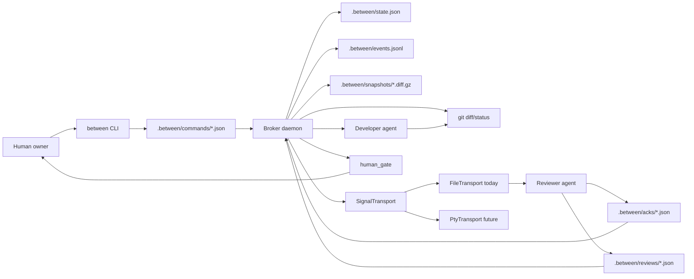

<div align="center">

# Between

**A local terminal broker for AI pair development.**

Coordinate a developer agent, a reviewer agent, and a human approval gate through durable project state instead of fragile chat handoffs.

[](https://nodejs.org/)
[](https://www.typescriptlang.org/)
[](#current-status)
[](#transport-model)
[](#license)

</div>

> Stop relaying agent messages by hand. Start brokering evidence.

Between is a local CLI/TUI system for running an AI pair-programming loop where the developer and reviewer agents never talk directly. The broker watches the target repository, snapshots meaningful `git diff` changes, asks the reviewer for a structured review, routes the result back to the developer, and stops at a human gate before merge or deploy.

The current implementation is a tested **headless walking skeleton** with durable `.between/` state, deterministic diff hashing, file-based signals, acknowledgements, review records, a command bus, and an Ink dashboard. Real PTY-hosted Claude/Codex panes are intentionally isolated behind the same transport port and are still deferred until a build-tools host can validate `node-pty`.

## Core Features

| Feature | What it does |
|---|---|
| Diff-driven broker loop | Polls the target repo, hashes canonical diff state, debounces edits, and opens review cycles only for meaningful changes. |
| No direct agent-to-agent chat | Developer and reviewer coordinate through `git diff`, `.between/*.json`, and optional Obsidian notes. |
| Durable state | Stores config, state, events, command files, signals, acknowledgements, reviews, verification records, and snapshots under `.between/`. |
| Headless transport | Uses `FileTransport` today: short signal pointers on disk, with full context read by each agent from the repo and state files. |
| Structured review gate | Tracks cycle phase, reviewed hashes, blocking findings, verification status, and human approval tokens. |
| Broker dashboard | Renders a broker-dominant Ink TUI with developer and reviewer regions via `between dash`. |
| Human-controlled merge/deploy | `between approve <merge|deploy|promote_rule>` records explicit human approval; agents do not merge or deploy autonomously. |
| Recovery-first design | Atomic writes, backups, single-writer lock, schema guards, event logs, and restart reconciliation are core primitives. |

## What Can You Do With It?

### Run a local headless review loop

Use Between inside any git repository to track goal, phase, diff hash, cycle count, and reviewer/developer handoff state.

```bash
between init
between goal "implement token refresh without leaking secrets"
between start --headless
between status
```

### Show the broker cockpit

Render the broker-first dashboard as a one-shot smoke check or as a live TUI.

```bash
between dash --once
between dash --interval 1000
```

### Use fake or file-fed agents before PTY integration

The current transport writes signal files that any agent, test helper, or script can consume.

```text
.between/signals/reviewer.json   -> reviewer reads state + diff, then writes an ack/review
.between/acks/<signal_id>.json   -> broker enters reviewing only after receipt
.between/reviews/cycle-0001.json -> structured findings for the current hash
.between/verify/cycle-0001.json  -> verification result for cycle completion
```

### Keep the human as final authority

Between can route work all the way to `human_gate`, but merge/deploy/rule promotion stays explicit.

```bash
between approve merge
between approve deploy
between approve promote_rule
```

## Why Between?

| Capability | Manual agent relay | Shared chat thread | Between |
|---|:---:|:---:|:---:|
| Developer and reviewer separated | No | No | Yes |
| Review grounded in `git diff` | Manual | Partial | Yes |
| Durable machine state | No | No | Yes |
| Debounced diff review cycles | No | No | Yes |
| Same-hash review skip | No | No | Yes |
| Recoverable after restart | No | No | Yes |
| Human merge/deploy gate | Manual | Manual | Built in |
| Terminal-native workflow | Partial | No | Yes |
| PTY-hosted agent panes | N/A | N/A | Planned |

## 60-Second Quick Start

### 1. Install dependencies

```bash
npm install
```

### 2. Verify the local build

```bash
npm run typecheck
npm test
npm run test:cov
npm run build
```

### 3. Initialize a target repo

Run this inside the repository you want Between to broker. For local development, the Between repo itself also works as a target.

```bash
node dist/cli.js init
node dist/cli.js status
```

### 4. Lock a goal and run bounded ticks

```bash
node dist/cli.js goal "ship the broker dashboard"
node dist/cli.js start --headless --max-ticks 3
node dist/cli.js status
```

### 5. Open the dashboard

```bash
node dist/cli.js dash --once
```

## CLI Reference

| Command | Purpose |
|---|---|
| `between init [--vault <path>]` | Create `.between/` scaffolding, config, and initial state in the current git repo. |
| `between status [--json]` | Print phase, cycle, waiting actor, diff hash, agents, and latest event. |
| `between start --headless [--max-ticks <n>]` | Run the broker watcher loop in file-signal mode. |
| `between goal <text...>` | Lock a new work goal for the broker cycle. |
| `between review-now` | Force a review of the current diff unless the hash was already reviewed. |
| `between ack` | Reviewer helper: acknowledge the outstanding review signal for the current cycle. |
| `between approve <scope>` | Record human approval for `merge`, `deploy`, or `promote_rule`. |
| `between pause` / `between resume` | Pause or resume the daemon through the command bus. |
| `between stop` | Ask the running broker loop to stop. |
| `between doctor` | Diagnose git, Between init state, vault config, and optional PTY availability. |
| `between summarize` | Summarize events and cycle counts. |
| `between dash [--once] [--interval <ms>]` | Render the Ink broker dashboard. `--interval` must be an integer >= 250. |

## Architecture



### Durable Surfaces

| Surface | Role |
|---|---|
| `git diff` | The code truth. The reviewer reads actual changes, not the developer's terminal. |
| `.between/config.yaml` | User tunables: watch interval, debounce window, review policy, vault path, retention, gates. |
| `.between/state.json` | Runtime source of truth: phase, cycle, diff hash, reviewed hashes, approval token, agent projection. |
| `.between/events.jsonl` | Append-only audit trail for transitions and cycle analytics. |
| `.between/signals/` | Short broker messages to developer/reviewer. The recipient reads full context separately. |
| `.between/acks/` | Delivery receipts. Reviewing is gated on a real ack. |
| `.between/reviews/` | Structured reviewer findings keyed by cycle/hash. |
| `.between/verify/` | Verification records for deciding whether a cycle can end. |
| `.between/snapshots/` | Scrubbed, bounded diff snapshots for review/recovery. |
| Obsidian vault | Optional human-readable memory and project wiki layer. |

### Module Map

| Directory | Responsibility |
|---|---|
| `src/core/` | Pure logic: FSM, debounce, diff hashing, cycle math, findings, phase projection, redaction, config schema. |
| `src/adapters/` | Git, state repository, event log, lock, command bus, signal transport, snapshots, paths. |
| `src/daemon/` | Broker loop and restart reconciliation. |
| `src/ui/` | Ink dashboard and visual tokens. |
| `src/cli.ts` | Commander entrypoint and user-facing verbs. |
| `test/` | Unit, integration, dashboard, and security tests. |

## Transport Model

Between does not rely on Windows Terminal keystroke injection. That path cannot reliably signal an already-running pane.

The system uses a `SignalTransport` port:

- **Current:** `FileTransport`, zero native dependencies, fully runnable in headless mode.
- **Future:** `PtyTransport`, broker-owned `node-pty` sessions for Claude/Codex panes once the native build path is validated.
- **Possible branch:** one-shot/file-fed CLI invocation if target agent CLIs support it cleanly.

This keeps the broker loop testable before terminal embedding exists.

## Current Status

| Area | Status |
|---|---|
| Headless loop | Implemented and test-covered. |
| Durable state/events/locks | Implemented. |
| Diff hashing and same-hash skip | Implemented. |
| File-based signal/ack/review flow | Implemented. |
| Dashboard | Implemented with `between dash`. |
| PTY-hosted agent panes | Deferred; `node-pty` is optional and lazily probed. |
| Obsidian scaffolding | Planned/partial depending on milestone state. |
| Merge/deploy detective enforcement | Planned. |
| Rule promotion | Planned/proposal-only. |

## Development

### Requirements

- Node.js `>=22.12.0`
- Git
- Windows, macOS, or Linux
- Optional for future terminal mode: native build tools capable of compiling `node-pty`

### Scripts

```bash
npm run typecheck
npm run lint
npm test
npm run test:cov
npm run build
npm run format
```

### Verification Notes

The deterministic core is covered by Vitest with fake clocks and real-git integration tests. The UI has Ink render tests plus real CLI/TUI smoke evidence. `node-pty` is not required for the headless path.

## Generated State and Git Ignore

Between intentionally creates local state that should not be committed:

```gitignore
node_modules/
dist/
coverage/
.between/
.omo/
*.log
.env
.env.*
!.env.example
*.tsbuildinfo
```

If a file was already tracked before being added to `.gitignore`, remove it from the index explicitly:

```bash
git rm --cached <path>
```

## Documentation

| Document | Purpose |
|---|---|
| [`BETWEEN-BROKER-BLUEPRINT.md`](./BETWEEN-BROKER-BLUEPRINT.md) | Original product concept and broker-agent model. |
| [`IMPROVEMENTS.md`](./IMPROVEMENTS.md) | Adversarial review backlog and risk rationale. |
| [`DEVELOPMENT-PLAN.md`](./DEVELOPMENT-PLAN.md) | Node.js + TypeScript implementation plan and milestone map. |
| [`TASKS.md`](./TASKS.md) | Living build tracker and current progress snapshot. |
| [`docs/adr/ADR-0001-transport.md`](./docs/adr/ADR-0001-transport.md) | Transport decision: file transport now, broker-owned PTY later. |
| [`docs/ui-design-spec.md`](./docs/ui-design-spec.md) | Broker dashboard visual system. |
| [`docs/archive/README-2026-06-19-docs-index.md`](./docs/archive/README-2026-06-19-docs-index.md) | Archived previous README. |

## Roadmap

1. Keep the headless walking skeleton green across Windows and Linux CI.
2. Validate one-shot/file-fed Claude and Codex invocation modes.
3. Validate `node-pty` build and runtime behavior on a host with native build tools.
4. Add the real PTY dashboard transport behind `SignalTransport`.
5. Finish Obsidian scaffolding and review-feed sync.
6. Add merge/deploy detective gates and rule-promotion proposals.

## License

MIT.
