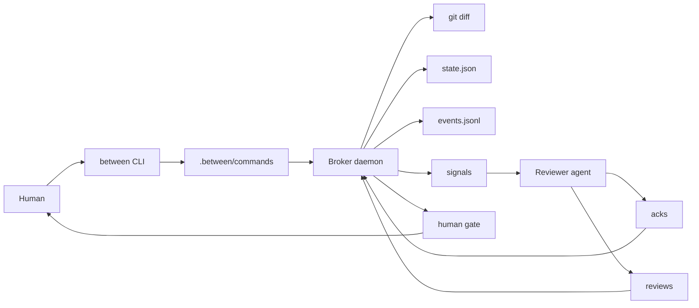

# Between

Between is a local broker for AI pair development.

It watches a git repository, records durable broker state under `.between/`,
asks a reviewer agent to inspect stable diffs, and keeps the human in charge of
merge, deploy, and rule promotion decisions.

The project is alpha. The file-based headless path is the verified baseline.
Terminal embedding and richer agent transports are under active development and
should be treated as experimental until the review blockers in `review.md` are
closed.

## Why It Exists

Most AI pair workflows use one shared chat or require a human to copy messages
between agents. Between uses a stricter shape:

- The developer and reviewer do not chat directly.
- The broker watches `git diff` and durable state instead of terminal output.
- Reviewer feedback is written as structured files.
- Human approval is required before merge, deploy, or rule promotion.
- State is restartable, inspectable, and friendly to an Obsidian-style vault.

## Current Status

Use Between today as a headless walking skeleton for the broker loop.

Verified pieces:

- `between init` creates `.between/` runtime state.
- `between goal` records a goal through the command bus.
- `between start --headless` polls git and opens review cycles.
- `FileTransport` writes reviewer signals to `.between/signals/`.
- Reviewer acknowledgements are read from `.between/acks/`.
- Structured review and verification files are parsed from `.between/`.
- `between dash` renders an Ink dashboard from broker state.

Known alpha limitations:

- Blocking reviewer feedback does not yet create a verified developer signal.
- `npm run test:cov` is currently unstable on this Windows host.
- PTY and one-shot agent embedding are being wired in active worktree changes.
- `@lydell/node-pty` and the runtime PTY probe still need alignment.
- Merge and deploy approval are protocol tokens, not a sandbox boundary.

## Installation

Requirements:

- Node.js 22.12.0 or newer.
- Git.
- Windows, macOS, or Linux.
- Optional native PTY support for future terminal embedding.

Install dependencies:

```bash
npm install
```

Build the CLI:

```bash
npm run build
```

During local development you can run the TypeScript entrypoint directly:

```bash
npm run between -- --help
```

After a build, use the bundled CLI:

```bash
node dist/cli.js --help
```

## Quick Start

Run these commands inside the git repository you want Between to broker.

```bash
node dist/cli.js init
node dist/cli.js goal "review the current change safely"
node dist/cli.js start --headless --max-ticks 3
node dist/cli.js status
node dist/cli.js dash --once
```

The headless transport writes files under `.between/` instead of controlling a
terminal pane.

## How The Broker Loop Works

The core loop is intentionally small:

1. The human locks a goal.
2. The broker polls the repository.
3. A stable diff hash opens a review cycle.
4. The broker writes a reviewer signal.
5. The reviewer writes an acknowledgement and a review record.
6. The broker advances state from the structured files.
7. The human gate remains the final authority.

The reviewer is expected to inspect the repository and current diff directly.
The developer and reviewer should not depend on a shared chat transcript.

## Runtime Files

Between creates a `.between/` directory inside the target repository.

Important files and directories:

- `.between/config.yaml`: user tunables and transport settings.
- `.between/state.json`: phase, cycle, hash, and approval state.
- `.between/events.jsonl`: append-only broker event log.
- `.between/commands/`: command bus from CLI to daemon.
- `.between/signals/`: broker messages to agents.
- `.between/acks/`: acknowledgement receipts.
- `.between/reviews/`: structured reviewer findings.
- `.between/verify/`: verification records for cycle completion.
- `.between/snapshots/`: scrubbed diff snapshots.

Do not commit `.between/`. `between init` adds it to `.gitignore`.

## CLI Reference

Initialize broker state:

```bash
between init
between init --vault C:\path\to\vault
```

Inspect state:

```bash
between status
between status --json
```

Run the broker loop:

```bash
between start --headless
between start --headless --max-ticks 5
```

Submit commands through the command bus:

```bash
between goal "describe the work"
between review-now
between pause
between resume
between stop
```

Reviewer helper:

```bash
between ack
```

Human approval tokens:

```bash
between approve merge
between approve deploy
between approve promote_rule
```

Diagnostics and summaries:

```bash
between doctor
between summarize
```

Dashboard:

```bash
between dash --once
between dash --interval 1000
```

`between dash --interval` requires an integer of at least 250 milliseconds.

## Transport Model

Between uses a `SignalTransport` port so the daemon is not tied to one agent
delivery mechanism.

Current baseline:

- `FileTransport` writes signal files and reads acknowledgement files.
- It has no native dependencies.
- It is the safest path for tests and headless automation.

Experimental work:

- One-shot transport can spawn an agent command per signal.
- PTY transport can host live terminal sessions when a PTY package is present.
- These modes must preserve the same acknowledgement and review file contract.

## Architecture



Main source areas:

- `src/core/`: pure state, diff, FSM, findings, and config logic.
- `src/adapters/`: git, file storage, locks, command bus, and transports.
- `src/daemon/`: broker loop and restart reconciliation.
- `src/ui/`: Ink dashboard.
- `src/cli.ts`: command registration.
- `test/`: unit, integration, security, and dashboard tests.

## Verification

Useful checks:

```bash
npm run lint
npm run typecheck
npm test
npm run test:cov
npm run build
```

Current review note:

- `npm run lint` passes.
- `npm run typecheck` passes.
- `npm test` can pass when run alone.
- `npm run test:cov` is a known blocker on this Windows host.

See `review.md` for the current deep-review blocker list.

## Git Ignore

Recommended local-only entries:

```gitignore
node_modules/
dist/
coverage/
.between/
.omo/
*.log
.env
.env.*
!.env.example
*.tsbuildinfo
```

If a file was already tracked before being added to `.gitignore`, remove it
from the index explicitly:

```bash
git rm --cached path/to/file
```

## Documentation

Start here:

- `BETWEEN-BROKER-BLUEPRINT.md`: original product concept.
- `DEVELOPMENT-PLAN.md`: Node.js and TypeScript implementation plan.
- `IMPROVEMENTS.md`: adversarial design review backlog.
- `TASKS.md`: build tracker.
- `review.md`: latest deep review and blocker list.
- `docs/adr/ADR-0001-transport.md`: transport decision.
- `docs/EMBED-PLAN.md`: terminal embedding plan, if present in your checkout.
- `docs/ui-design-spec.md`: dashboard design notes.

## Roadmap

Near-term work:

1. Close the blocking-review developer signal gap.
2. Stabilize `npm run test:cov` on Windows.
3. Align optional PTY dependency names with the runtime probe.
4. Finish one-shot and PTY transport wiring behind `SignalTransport`.
5. Add Obsidian project file scaffolding.
6. Add detective merge and deploy checks.

## License

MIT.
