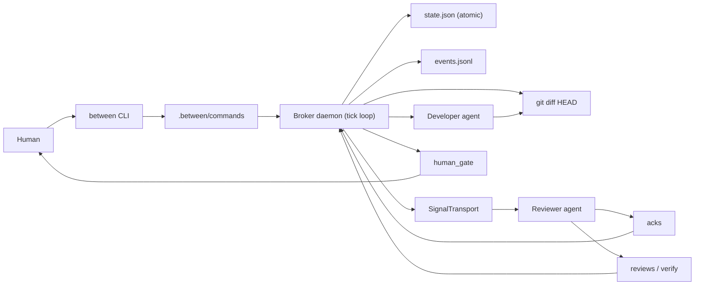

<div align="center">

```
██████╗ ███████╗████████╗██╗    ██╗███████╗███████╗███╗   ██╗
██╔══██╗██╔════╝╚══██╔══╝██║    ██║██╔════╝██╔════╝████╗  ██║
██████╔╝█████╗     ██║   ██║ █╗ ██║█████╗  █████╗  ██╔██╗ ██║
██╔══██╗██╔══╝     ██║   ██║███╗██║██╔══╝  ██╔══╝  ██║╚██╗██║
██████╔╝███████╗   ██║   ╚███╔███╔╝███████╗███████╗██║ ╚████║
╚═════╝ ╚══════╝   ╚═╝    ╚══╝╚══╝ ╚══════╝╚══════╝╚═╝  ╚═══╝
```

### Watch the diff. Broker the review. Keep the human in charge.

A **local terminal broker for AI pair development**. Between runs a developer
agent and a reviewer agent that **never talk to each other** — they coordinate
through `git diff`, durable JSON state, and structured files under `.between/`,
while **you** stay the only one who can merge or deploy. Observable, restartable,
and honest about what it is.

[](https://github.com/ashmoonori-afk/between/actions/workflows/ci.yml)
[](https://nodejs.org/)
[](https://www.typescriptlang.org/)
[](#-verification)
[](#-license)

</div>

---

Most AI pair-programming setups put two agents in one chat, or make a human relay
messages between them. Between takes a stricter, calmer shape: the broker watches
the **repository**, not the agents' private reasoning. A reviewer is asked to look
at a real, stable `git diff` — never a transcript — and writes its verdict to a
file. The loop survives restarts, refuses to approve a diff that changed under it,
and stops at a **human gate** before anything irreversible.

- 🧭 **Agents never chat directly.** Coordination is `git diff` (code truth),
  `.between/*.json` (machine truth), and an optional Obsidian vault (human memory).
- 🔁 **Diff-driven cycles.** The broker polls, hashes, debounces, and opens a
  review cycle only for a _meaningful, stable_ change — and never reviews the same
  hash twice.
- 🧱 **Recovery-first.** Atomic state writes, a `.bak` fallback, a single-writer
  lock, an append-only event log, restart reconciliation, and signal re-send.
- 🛑 **Human-owned merges.** `between approve merge|deploy|promote_rule` is the
  only way past `human_gate`; agents cannot self-merge.
- 🖥️ **Observable.** A broker-dominant Ink dashboard (`between dash`) and an
  embedded window that hosts the two agent panes live.
- 💬 **Drive it from chat.** `between gateway` bridges **Telegram or Discord** to the
  broker — `status`, `goal`, and **signed** approvals over chat. Bot tokens stay in
  env, never in `config.yaml`. Both channels can run as a **pull/poll** model
  (Telegram long-poll; Discord `discord_mode: poll` REST polling — no privileged
  intent, and it replays messages missed while offline).
- 🧱 **Idea → ship, builtin.** `between forge` drives a 12-phase app-build lifecycle
  (PWSForge) with phase gates and **CLI-forced execution**: it never codes inline —
  it routes build tasks to the broker's developer/reviewer loop.

---

## 🎯 Design intent

Between is deliberately **small, file-shaped, and careful**.

1. **The repository is the contract.** `git diff` is the review object; the
   reviewer reads the real tree, not a chat log. Staging never changes the hash
   (it is computed against `HEAD`).
2. **Files are the protocol.** Signals, acks, reviews, verification, commands, and
   approval are plain JSON under `.between/`. Inspectable, replayable, and easy to
   wire any agent to (see [`docs/AGENT-CONTRACT.md`](./docs/AGENT-CONTRACT.md)).
3. **The headless path is the baseline.** `agent_mode: file` has **zero native
   dependencies** and is the verified, tested core. Terminal embedding is additive.
4. **One stable transport port.** `FileTransport`, `OneShotTransport`, and
   `PtyTransport` all implement the same `SignalTransport` — and the PTY/one-shot
   modes reuse the exact same ack-file gate, so nothing is faked.
5. **Hexagonal & honest.** A pure `core/` (FSM, diff-hash, debounce, cycle) with an
   injected clock, `adapters/` for IO, a thin `daemon/`, and an `ui/` layer — and a
   README that says plainly where the alpha edges are.

---

## 🚀 Install

Requires **Node.js ≥ 22.12**, **git**, and Windows / macOS / Linux.

```bash
git clone https://github.com/ashmoonori-afk/between
cd between
npm install
npm run build        # bundles dist/cli.js
```

During development you can run the TypeScript entrypoint directly:

```bash
npm run between -- --help     # via tsx, no build step
# after a build:
node dist/cli.js --help
```

> Optional: live PTY-hosted agent panes use `@lydell/node-pty` (prebuilt — no
> compiler needed on common platforms). It is an **optional** dependency; if it
> isn't present, Between degrades to the one-shot/file path automatically.

---

## 🎮 Quick start

Run inside the git repository you want Between to broker (the Between repo itself
works as a target during local development).

```bash
node dist/cli.js onboard                               # first-run: scaffold + pick a gateway
node dist/cli.js goal "refresh tokens without leaking secrets"
node dist/cli.js start --headless --max-ticks 6        # drive the file-signal loop
node dist/cli.js status                                # phase, cycle, waiting actor
node dist/cli.js dash --once                           # render the broker cockpit
```

`between onboard` is the first-run wizard: it scaffolds `.between/`, lets you pick a
chat channel (`echo` / `telegram` / `discord`), persists the non-secret chat id, and
**smoke-tests the credentials** — the bot token is read from `BETWEEN_TELEGRAM_TOKEN`
/ `BETWEEN_DISCORD_TOKEN` and is never written to disk. (`between init` still does the
bare scaffold if you prefer to wire config by hand.)

### See it end-to-end with the bundled agent

`between init` writes a stdlib-only `fake-agent` so the whole loop is demoable with
**zero external CLIs**:

```bash
# choose the one-shot embed (spawns the agent per signal) and run it:
node dist/cli.js init --agent fake
# ...edit a file in the repo, then:
node dist/cli.js start --embed     # opens the broker + developer/reviewer panes
```

Wire real agents when you're ready — `between init --agent claude|codex` writes a
wrapper and points `developer_command` / `reviewer_command` at it (see the
[agent contract](./docs/AGENT-CONTRACT.md)).

---

## 🔁 How the broker loop works

```
goal_locked ─▶ developing ─▶ debouncing ─▶ review_requested ─▶ reviewing
                  ▲                                                 │
                  │                                      review_written
        new developer diff                                         │
                  │                          ┌── blocking ─▶ applying_review
              human_gate ◀── verify_passed ──┴── clean + verify ok
```

1. The human locks a **goal**.
2. The broker polls the repo and computes a deterministic **diff hash**.
3. A change that stays **stable through the debounce window** opens a **cycle** —
   the new cycle is persisted _before_ any signal (crash-safe), and the same hash
   is never reviewed twice.
4. The broker writes a short **reviewer signal**; the reviewer reads the diff +
   state itself and writes an **ack**, a **review record**, and a **verification**.
5. **Blocking** findings send a **developer signal**; a **clean** review + passing
   verify advances to **`human_gate`**.
6. A diff that changes while a review is outstanding is **superseded** (no stale
   approval); a missing signal after a restart is **re-sent**; a dead hosted agent
   is surfaced as broker state.
7. **Merge / deploy / rule-promotion** wait for an explicit human token.

---

## 🧩 Agent modes

One `SignalTransport` port, three ways to drive agents — selected by
`agent_mode` in `.between/config.yaml`:

| Mode               | What it does                                                                     | Native deps | Status                   |
| ------------------ | -------------------------------------------------------------------------------- | :---------: | ------------------------ |
| `file` _(default)_ | Broker writes signal files; any agent/script reads & replies via `.between/`.    |    none     | ✅ verified baseline     |
| `oneshot`          | Spawns `developer_command` / `reviewer_command` once per signal (body on stdin). |    none     | ✅ runnable everywhere   |
| `pty`              | Hosts a live ConPTY/forkpty terminal per agent via optional `@lydell/node-pty`.  |  optional   | 🧪 embed (auto-degrades) |

All three deliver short pointers and **reuse the same `.between/acks/<id>.json`
gate** — `reviewing` only advances on a real acknowledgement.

---

## 📟 CLI cheat sheet

```bash
between onboard [--channel echo|telegram|discord] [--agent ...] [--chat-id <id>] [--yes]
between init [--vault <path>] [--agent fake|claude|codex]   # bare scaffold + pick agents
between goal "<text>"                # lock a work goal (via the command bus)
between start [--embed] [--headless] [--max-ticks <n>]      # run the broker loop
between status [--json]              # phase, cycle, diff hash, waiting actor
between dash [--once] [--interval <ms>]                     # Ink broker dashboard
between gateway [--max-seconds <n>]  # bridge Telegram/Discord/echo to the broker
between review-now                   # force a review of the current diff
between pause | resume | stop        # control the running daemon
between ack                          # reviewer helper: ack the current signal
between approve merge|deploy|promote_rule                  # signed human approval token
between verify-push                  # pre-push gate: block a forged/unapproved push
between doctor                       # diagnose git, init state, PTY availability
between summarize                    # cycle/phase analytics from events.jsonl
```

### Forge — builtin idea-to-ship lifecycle

```bash
between forge init "<idea>" [--platform ios,android,web]   # scaffold docs/pwsforge/
between forge status                 # phase (n/12), gate open/closed, blockers
between forge approve                # mark the current phase approved (satisfies the gate)
between forge advance                # move to the next phase (refused while the gate is closed)
between forge block P0|P1|P2|P3 "<desc>" · between forge unblock <index>
between forge build "<task>"         # CLI-forced: route the build to the broker (never inline)
```

`--interval` must be an integer ≥ 250 ms. On a non-TTY (or `NO_COLOR`) `doctor` and
`onboard` fall back to non-interactive / ASCII behavior.

---

## 🗂️ Runtime files

`between init` creates a `.between/` directory inside the **target** repo (and
adds it to `.gitignore` so the broker's own writes can't self-trigger a review):

```
.between/
├─ config.yaml          # tunables: watch/debounce/cycle, retention, agent mode
├─ state.json (+ .bak)  # phase, cycle, diff hash, reviewed hashes, approval
├─ events.jsonl         # append-only broker event log (analytics source)
├─ commands/            # CLI → daemon command bus (single-writer safe)
├─ signals/             # broker → agent pointers
├─ acks/                # agent → broker receipts (gates `reviewing`)
├─ reviews/ · verify/   # structured findings + verification per cycle
├─ snapshots/           # gzipped, secret-scrubbed, bounded diff snapshots
└─ agents/              # bundled fake-agent + any real wrapper
```

---

## 🗺️ Architecture



Source map:

- `src/core/` — pure, injected-clock logic: FSM, diff-hash, debounce, cycle math,
  config schema (zod), findings, redaction, state projection.
- `src/adapters/` — git, atomic state repo, events log, single-writer lock, command
  bus, signal transports, agent hosts (pipe/pty), snapshot store.
- `src/daemon/` — `loop.ts` (the `Daemon`), `phases.ts`, `commands.ts`, `context.ts`,
  reconciliation, and reviewer-signal recovery.
- `src/ui/` — Ink dashboard, agent panes, embedded window (`DESIGN.md` is the TUI
  design system).
- `src/gateway/` — chat bridge: `ChatTransport` port + echo/Telegram/Discord
  transports + `GatewaySession` (routes chat → command bus, signed approvals).
- `src/onboard/` — first-run wizard: pure `plan` (config patch, env-only tokens),
  `smoke` (credential check), injected-IO `wizard`.
- `src/forge/` — builtin PWSForge lifecycle: `phases` + `state` (zod) + pure
  `machine` (gates) + `repository` + `build` (CLI-forced broker handoff).
- `src/cli.ts` — command registration.

---

## 🔒 Trust boundary (read this)

`.between/` is a **cooperative local protocol, not a full security boundary.** Any
local process that can write `.between/` can forge ack/review/verify files — the
review _workflow_ is a convention. But the **approval** step now has teeth (P1-5):
`between approve` is **HMAC-signed** with a secret kept **outside** `.between/` (env
`BETWEEN_APPROVAL_SECRET` or `.git/between-approval.key`, stripped from spawned-agent
env), and `between init` installs a **pre-push hook** (`between verify-push`) that
blocks a push whose recorded approval fails signature verification. An agent that can
only write `.between/` cannot forge an approval the daemon or the hook will accept.
Still: don't run Between with untrusted agents where an unapproved merge/deploy would
be harmful.

---

## ✅ Verification

```bash
npm run typecheck     # tsc --noEmit (strict)
npm run lint          # prettier --check
npm test              # vitest: 145 tests / 29 files
npm run test:cov      # ≥80% gate on src/core (~95% lines)
npm run build         # tsup → dist/cli.js (target node22)
```

CI runs the full gate on a **GitHub Actions matrix** (ubuntu + windows × Node
22/24), plus a non-blocking `node-pty` prebuilt probe. Production `npm audit` is
clean; a single low-severity **dev-only** esbuild advisory remains.

---

## 📚 Documentation

| File                                                           | What it is                                                           |
| -------------------------------------------------------------- | -------------------------------------------------------------------- |
| [`BETWEEN-BROKER-BLUEPRINT.md`](./BETWEEN-BROKER-BLUEPRINT.md) | Original product concept (referenced as §N).                         |
| [`DEVELOPMENT-PLAN.md`](./DEVELOPMENT-PLAN.md)                 | Node/TS implementation plan (M0–M7), schemas, acceptance map.        |
| [`IMPROVEMENTS.md`](./IMPROVEMENTS.md)                         | Adversarial design review backlog (`I1`–`I26`).                      |
| [`TASKS.md`](./TASKS.md)                                       | Phase → task build tracker.                                          |
| [`docs/AGENT-CONTRACT.md`](./docs/AGENT-CONTRACT.md)           | What an agent reads/writes; claude/codex commands.                   |
| [`docs/adr/`](./docs/adr/)                                     | ADR-0001 (transport), ADR-0002 (agent invocation).                   |
| [`DESIGN.md`](./DESIGN.md)                                     | Compact TUI design system for the broker/agent panes.                |
| `review.md`                                                    | Latest deep review (RESOLVED vs TRACKED). _(local-only, gitignored)_ |

---

## 🛠️ Where Between is today

Between is **alpha**. The file-signal headless loop is the verified baseline;
embedding (one-shot + PTY) and real-CLI wiring are additive and improving.

**Tracked next:** Obsidian project-file scaffolding · detective merge/deploy checks
· a stronger-than-cooperative approval boundary · smoke-testing real claude/codex
wrappers on target machines · deeper interactive-embed visual QA.

---

## 📄 License

MIT.
